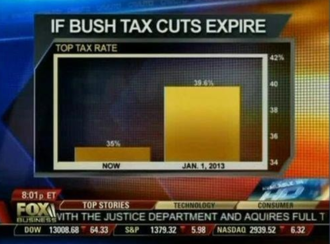

```{r setup, include=FALSE}
library(knitr)
library(tidyverse)
library(lubridate)
knitr::opts_chunk$set(echo = TRUE)
knitr::knit_hooks$set(mysize = function(before, options, envir) {
  if (before) 
    return(options$size)
})
```

# Data Viz Resources

## Edward Tufte{.centered}


## William Cleveland{.centered}


## Nathan Yau (FlowingData){.centered}


# Telling Stories with Data

## Telling Stories with Data{.centered}


## Telling Stories with Data

- What is Statistics?
    - hypothesis tests
    - pattern finding
    - predictive modeling
    - *storytelling with data* can help you solve real-world problems (predicting unrest, decreasing crime) or it can help you stay more informed

# Data viz is more than numbers

## Journalism{.centered}


## Art{.centered}


## Entertainment{.centered}


## Compelling - Hans Rosling


[http://www.youtube.com/embed/jbkSRLYSojo?rel=0](http://www.youtube.com/embed/jbkSRLYSojo?rel=0)


# Data Viz: What to look for

## Patterns{.centered}


## Relationships{.centered}


## Questionable Data{.centered}



# Design Principles

## Explain Encodings{.centered}


## Explain Encodings{.centered}


## Label Axes{.centered}


## Keep Geometry in Check{.centered}


## Include Sources{.centered}


## Spotting Visualization Lies{.centered}


# Types of Graphs


## Why use Graphics

- Why do you, or have you, in the past used data graphics?
    - Exploratory Graphics
    - Publication Graphics
    - Presentation Graphics

# Graphics in R

## Visualizing Patterns Over Time

- What are we looking for with data over time?
    - Trends (increasing/decreasing)
    - Are season cycles present?
- Identifying these patterns requires looking beyond single points
- We are also interested in looking at more the data in more detail
    - Are there outliers?
    - Do any time periods look out of place?
    - Are there spikes or dips?
    - What causes any of these irregularities?


## Capital BikeShare{.centered}


## Capital BikeShare{.centered}


## Capital Bikeshare Data

```{r , mysize=TRUE, size='\\tiny'}
bike.data <- read_csv('http://www.math.montana.edu/ahoegh/teaching/stat408/datasets/Bike.csv')
```

## Capital Bikeshare Data

```{r}
bike.data <- bike.data %>% mutate(year = as.factor(year(datetime)), month = as.factor(month(datetime)))
monthly.counts <- bike.data %>% group_by(month) %>% summarize(num_bikes = sum(count), .groups = 'drop') %>% arrange(month)
monthly.counts
```

## Discrete Points: Bar Charts

```{r, echo = F}
monthly.counts %>% ggplot(aes(y = num_bikes, x = month)) + geom_bar(stat = 'identity') + xlab('Month') + ylab('Bike Rentals') + labs(title = 'Bike Rentals per Month in 2011-2012 \n Capital Bikeshare in Washington, DC', caption = 'Source: www.capitalbikeshare.com')
```


## Discrete Points: Bar Charts - Code

```{r,echo=T,eval=F, mysize=TRUE, size='\\tiny'}
monthly.counts %>% 
  ggplot(aes(y = num_bikes, x = month)) + 
  geom_bar(stat = 'identity') + xlab('Month') + 
  ylab('Bike Rentals') + 
  labs(title = 'Bike Rentals per Month in 2011-2012 \n Capital Bikeshare in Washington, DC', 
       caption = 'Source: www.capitalbikeshare.com')
```

## Discrete Points: Stacked Bar 
```{r,echo=F,fig.align='center'}
bike.counts <- aggregate(cbind(bike.data$casual,bike.data$registered),by=list(bike.data$month), sum)
# Stacked Bar Plot with Colors and Legend
barplot(t(as.matrix(bike.counts[,-1])), 
        names.arg =collect(select(monthly.counts, month))[[1]], 
        xlab='Month', 
        sub ='Source: www.capitalbikeshare.com', ylab='Bike Rentals', main='Bike Rentals per Month in 2011 - 2012 \n Capital Bikeshare in Washington, DC', 
        col=c("darkblue","red"),legend.text = c("Casual", "Registered"),args.legend = list(x = "topleft"))
```

## Discrete Points in Time: Stacked Bar - Code
```{r,eval=F, mysize=TRUE, size='\\tiny'}
bike.counts <- aggregate(cbind(bike.data$casual,bike.data$registered),
                         by=list(bike.data$month), sum)
barplot(t(as.matrix(bike.counts[,-1])), 
        names.arg =collect(select(monthly.counts, month))[[1]], 
        xlab='Month', sub ='Source: www.capitalbikeshare.com', 
        ylab='Bike Rentals', 
        main='Bike Rentals per Month in 2011 - 2012 \n Capital Bikeshare in Washington, DC',
        col=c("darkblue","red"),legend.text = c("Casual", "Registered"),
        args.legend = list(x = "topleft"))
```

## Discrete Points in Time: Points
```{r,echo=F}
plot(rowSums(bike.counts[,-1])~bike.counts[,1],xlab='Month', sub ='Source: www.capitalbikeshare.com', 
        ylab='Bike Rentals', main='Bike Rentals per Month \n Capital Bikeshare in Washington, DC',
        col=c("darkblue"),pch=16)
```

## Discrete Points in Time: Points
```{r,echo=F}
plot(rowSums(bike.counts[,-1])~bike.counts[,1],xlab='Month', sub ='Source: www.capitalbikeshare.com', 
        ylab='Bike Rentals', main='Bike Rentals per Month \n Capital Bikeshare in Washington, DC',
        col=c("darkblue"),pch=16,ylim=c(0,max(rowSums(bike.counts[,-1]))),axes=F)
axis(2)
axis(1,at=1:12)
box()
```

## Discrete Points in Time: Points
```{r,eval=F, mysize=TRUE, size='\\tiny'}
plot(rowSums(bike.counts[,-1])~bike.counts[,1],xlab='Month',
     sub ='Source: www.capitalbikeshare.com', ylab='Bike Rentals', 
     main='Bike Rentals per Month \n Capital Bikeshare in Washington, DC',
     col=c("darkblue"),pch=16,axes=F,
     ylim=c(0,max(rowSums(bike.counts[,-1]))))
axis(2)
axis(1,at=1:12)
box()
```


## Connect the Dots
```{r,echo=F}
mean_temp <- bike.data %>% group_by(month) %>% summarize(mean_temp = mean(temp), .groups = 'drop') %>% mutate(month = as.numeric(month))

ggplot(aes(y=temp, x= month), data = bike.data) + geom_jitter(alpha = .1) + geom_line(inherit.aes = F, aes(y = mean_temp, x = month), data = mean_temp, color = 'red', lwd = 2) + ylab('Average Temp (C)') + xlab('Month') + labs(title = 'Average Temperature in Washington, DC', caption = 'Source: www.capitalbikeshare.com')
```

## Connect the Dots
```{r,eval=F, mysize=TRUE, size='\\tiny'}
mean_temp <- bike.data %>% group_by(month) %>%
  summarize(mean_temp = mean(temp),.groups = 'drop') %>% 
  mutate(month = as.numeric(month))

ggplot(aes(y=temp, x= month), data = bike.data) +
  geom_jitter(alpha = .1) + 
  geom_line(inherit.aes = F, aes(y = mean_temp, x = month),
            data = mean_temp, color = 'red', lwd = 2) +
  ylab('Average Temp (C)') + xlab('Month') + 
  labs(title = 'Average Temperature in Washington, DC', 
                       caption = 'Source: www.capitalbikeshare.com')
```

## Visualizing Proportions

- What to look for in proportions?
    - Generally looking for maximum, minimum, and overall distribution.
- Many of the figures we have discussed are useful here as well: for example, stacked bar charts or points to look at changes in proportions over time.
- Another possibility, which we will not cover, are plotting with rectangles known as a tree map.

## Visualizing Relationships

- When considering relationships between variables, what are we looking for?
    - If something goes up, do other variables have a positive relationship, negative relationship, or no relationship.
    - What is the distribution of your data? (both univariate and multivariate)
    


## Relationships: Scatterplots
```{r,echo=F}
bike.data$tempF <- bike.data$temp * 1.8 + 32
plot(bike.data$count~bike.data$tempF,pch=16,col=rgb(100,0,0,10,max=255),ylab='Hourly Bike Rentals',xlab='Temp (F)',sub ='Source: www.capitalbikeshare.com',main='Hourly Bike Rentals by Temperature')
bike.fit <- loess(count~tempF,bike.data)
temp.seq <- seq(min(bike.data$tempF),max(bike.data$tempF))
lines(predict(bike.fit,temp.seq)~temp.seq,lwd=2)
```


## Visualizing Relationships: Scatterplots - code
```{r, eval=F, mysize=TRUE, size='\\scriptsize'}
bike.data$tempF <- bike.data$temp * 1.8 + 32
plot(bike.data$count~bike.data$tempF,pch=16,
     col=rgb(100,0,0,10,max=255),ylab='Hourly Bike Rentals',
     xlab='Temp (F)',sub ='Source: www.capitalbikeshare.com',
     main='Hourly Bike Rentals by Temperature')
bike.fit <- loess(count~tempF,bike.data)
temp.seq <- seq(min(bike.data$tempF),max(bike.data$tempF))
lines(predict(bike.fit,temp.seq)~temp.seq,lwd=2)
```

## Visualizing Relationships: Multivariate Scatterplots
```{r,echo=T, mysize=TRUE, size='\\scriptsize'}
pairs(bike.data[,c(12,15,8)])
```

## Multivariate Scatterplots
```{r,echo=F, mysize=TRUE, size='\\scriptsize'}
par(mfcol=c(2,2),oma = c(1,0,0,0))
bike.data$tempF <- bike.data$temp * 1.8 + 32
plot(bike.data$count~bike.data$tempF,pch=16,col=rgb(100,0,0,10,max=255),
     ylab='Hourly Bike Rentals',xlab='Temp (F)',main='Hourly Bike Rentals by Temperature')
bike.fit <- loess(count~tempF,bike.data)
temp.seq <- seq(min(bike.data$tempF),max(bike.data$tempF))
lines(predict(bike.fit,temp.seq)~temp.seq,lwd=2)

plot(bike.data$count~bike.data$humidity,pch=16,col=rgb(100,0,100,10,max=255),
     ylab='Hourly Bike Rentals',xlab='Humidity (%)',main='Hourly Bike Rentals by Humidity')
bike.fit <- loess(count~humidity,bike.data)
humidity.seq <- seq(min(bike.data$humidity),max(bike.data$humidity))
lines(predict(bike.fit,humidity.seq)~humidity.seq,lwd=2)

plot(bike.data$count~bike.data$windspeed,pch=16,col=rgb(0,0,100,10,max=255),
     ylab='Hourly Bike Rentals',xlab='Windspeed (MPH)',main='Hourly Bike Rentals by Windspeed')
bike.fit <- loess(count~windspeed,bike.data)
windspeed.seq <- seq(min(bike.data$windspeed),max(bike.data$windspeed))
lines(predict(bike.fit,windspeed.seq)~windspeed.seq,lwd=2)

plot(bike.data$count~as.factor(bike.data$weather),col=rgb(0,100,0,255,max=255),
     ylab='Hourly Bike Rentals',xlab='Weather Conditions',main='Hourly Bike Rentals by Weather')

mtext('Source: www.capitalbikeshare.com', outer = TRUE, cex = .9, side=1)
par(mfcol=c(1,1),oma = c(0,0,0,0))
```

## Relationships: Multivariate Scatterplots 
```{r, eval=F, mysize=TRUE, size='\\tiny'}
par(mfcol=c(2,2),oma = c(1,0,0,0))
bike.data$tempF <- bike.data$temp * 1.8 + 32
plot(bike.data$count~bike.data$tempF,pch=16,col=rgb(100,0,0,10,max=255),
     ylab='Hourly Bike Rentals',xlab='Temp (F)',
     main='Hourly Bike Rentals by Temperature')
bike.fit <- loess(count~tempF,bike.data)
temp.seq <- seq(min(bike.data$tempF),max(bike.data$tempF))
lines(predict(bike.fit,temp.seq)~temp.seq,lwd=2)

plot(bike.data$count~bike.data$humidity,pch=16,
     col=rgb(100,0,100,10,max=255),
     ylab='Hourly Bike Rentals',xlab='Humidity (%)',
     main='Hourly Bike Rentals by Humidity')
bike.fit <- loess(count~humidity,bike.data)
humidity.seq <- seq(min(bike.data$humidity),max(bike.data$humidity))
lines(predict(bike.fit,humidity.seq)~humidity.seq,lwd=2)

plot(bike.data$count~bike.data$windspeed,pch=16,col=rgb(0,0,100,10,max=255),
     ylab='Hourly Bike Rentals',xlab='Windspeed (MPH)',main='Hourly Bike Rentals by Windspeed')
bike.fit <- loess(count~windspeed,bike.data)
windspeed.seq <- seq(min(bike.data$windspeed),max(bike.data$windspeed))
lines(predict(bike.fit,windspeed.seq)~windspeed.seq,lwd=2)

plot(bike.data$count~as.factor(bike.data$weather),col=rgb(0,100,0,255,max=255),
     ylab='Hourly Bike Rentals',xlab='Weather Conditions',main='Hourly Bike Rentals by Weather')

mtext('Source: www.capitalbikeshare.com', outer = TRUE, cex = .9, side=1)
par(mfcol=c(1,1),oma = c(0,0,0,0))

```


## Relationships: Histograms
```{r,  echo = F}
hist(bike.data$tempF,prob=T, main='Temperature (F)',col='red',xlab='')
```

## Relationships: Histograms
```{r,  eval = F}
hist(bike.data$tempF,prob=T, main='Temperature (F)',col='red',xlab='')
```


## Multiple Histograms
```{r,echo=F}
par(mfrow=c(2,1))
bike.data$reltempF <- bike.data$atemp * 1.8 + 32

hist(bike.data$tempF,prob=T,breaks='FD',
     main='Temperature (F)',col='red',xlab='',xlim=c(0,max(c(bike.data$reltempF,bike.data$tempF))))
hist(bike.data$reltempF,prob=T,breaks='FD',
     main='Relative Temperature (F)',col='orange',xlab='',
     xlim=c(0,max(c(bike.data$reltempF,bike.data$tempF))))
```


## Visualizing Relationships: Multiple Histograms - Code
```{r, eval=F, mysize=TRUE, size='\\footnotesize'}
par(mfrow=c(2,1))
bike.data$reltempF <- bike.data$atemp * 1.8 + 32

hist(bike.data$tempF,prob=T,breaks='FD',
     main='Temperature (F)',col='red',xlab='',
     xlim=c(0,max(c(bike.data$reltempF,bike.data$tempF))))
hist(bike.data$reltempF,prob=T,breaks='FD',
     main='Relative Temperature (F)',col='orange',xlab='',
     xlim=c(0,max(c(bike.data$reltempF,bike.data$tempF))))
```


## Exercise: Visualizing Relationships

- Summarize (visually) some relationship from the bike data set